<div align="center">

# 🛡️ Fraud Detection — Multi-Class Classification

### 🏆 HackML 2026 | SFU Data Science Student Society | Kaggle Competition

[](https://python.org)
[](https://xgboost.readthedocs.io)
[](https://scikit-learn.org)
[](https://kaggle.com/competitions/fraud-hack-ml-2026)

*Can we predict how urgently a suspicious transaction needs to be investigated?*

</div>

---

## 📖 Table of Contents

- [🎯 Problem Statement](#-problem-statement)
- [📊 Data Overview](#-data-overview)
- [⚙️ Our Approach](#️-our-approach)
- [🔬 Feature Engineering](#-feature-engineering)
- [🧠 Model Architecture](#-model-architecture)
- [📈 Results](#-results)
- [💡 Key Learnings](#-key-learnings)
- [🚀 Quick Start](#-quick-start)
- [📁 Project Structure](#-project-structure)
- [👥 Team](#-team)

---

## 🎯 Problem Statement

Financial institutions process **millions of transactions daily**, with only a tiny fraction being fraudulent. Rather than a simple binary *"Is this fraud?"*, this competition asks a more nuanced question:

> **How urgently should a suspicious transaction be investigated?**

We built a **multi-class classifier** to assign each transaction one of **four urgency levels**:

| 🏷️ Label | 📋 Level | 💼 Business Context |
|:---------:|----------|---------------------|
| **0** | ✅ No Action | Transaction appears legitimate |
| **1** | 👀 Monitor | Low-risk suspicious activity |
| **2** | 🔍 Review | Likely fraud requiring analyst review |
| **3** | 🚨 Immediate Action | High-risk fraud requiring urgent response |

---

## 📊 Data Overview

### Dataset at a Glance

| Metric | Value |
|--------|-------|
| **Total Transactions** | 6,244,474 |
| **Features (Raw)** | 10 columns |
| **Engineered Features** | 17 new features |
| **Target Classes** | 4 urgency levels |
| **Test Set** | ~118K transactions |

### ⚠️ The Core Challenge: Extreme Class Imbalance

This is what makes this problem **really hard**. The class distribution is massively skewed:

```
Class 0 (No Action)   ██████████████████████████████████████████████████  99.89%  (6,237,903)
Class 1 (Monitor)     ▏                                                   0.035%  (    2,176)
Class 2 (Review)      ▏                                                   0.034%  (    2,151)
Class 3 (Immediate)   ▏                                                   0.036%  (    2,244)
```

> **Classes 1–3 combined represent less than 0.11% of all data** — a classic real-world fraud distribution where legitimate transactions vastly outnumber fraudulent ones.

### Raw Features

| Column | Type | Description |
|--------|------|-------------|
| `step` | int | Time unit (1 step = 1 hour of simulation) |
| `type` | str | Transaction type: CASH_IN, CASH_OUT, DEBIT, PAYMENT, TRANSFER |
| `amount` | float | Transaction amount in local currency |
| `oldbalanceOrg` | float | Sender's balance **before** transaction |
| `newbalanceOrig` | float | Sender's balance **after** transaction |
| `oldbalanceDest` | float | Receiver's balance **before** transaction |
| `newbalanceDest` | float | Receiver's balance **after** transaction |
| `nameOrig` | str | Anonymized sender identifier |
| `nameDest` | str | Anonymized receiver identifier |
| `urgency_level` | int | 🎯 **Target** — investigation urgency (0–3) |

---

## ⚙️ Our Approach

Here's an overview of our end-to-end ML pipeline:

```mermaid
flowchart LR
    A["🗃️ Raw Data\n6.2M rows"] --> B["⚙️ Feature\nEngineering"]
    B --> C["⚖️ SMOTE\nOversampling"]
    C --> D["🌲 XGBoost\n5-Fold CV"]
    D --> E["🗳️ Majority\nVote"]
    E --> F["📤 Final\nPredictions"]

    style A fill:#1e3a5f,stroke:#4a9eff,color:#fff
    style B fill:#2d4a3e,stroke:#4aff9e,color:#fff
    style C fill:#4a3a1e,stroke:#ffa64a,color:#fff
    style D fill:#3a1e4a,stroke:#a64aff,color:#fff
    style E fill:#4a1e3a,stroke:#ff4a9e,color:#fff
    style F fill:#1e4a3a,stroke:#4affa6,color:#fff
```



### What We Did Step by Step

1. **Loaded & explored** 6.2M transactions to understand patterns
2. **Engineered 17 features** capturing balance anomalies, ratios, and temporal patterns
3. **Applied SMOTE** to synthetically balance minority classes within each CV fold
4. **Trained XGBoost** across 5 stratified folds for robust evaluation
5. **Combined predictions** using majority voting across all fold models
6. **Generated submission** file for Kaggle leaderboard

---

## 🔬 Feature Engineering

We derived **17 engineered features** from the raw transaction data. These features were designed to capture signals that differentiate fraudulent from legitimate transactions:

```mermaid
mindmap
  root((17 Engineered Features))
    💰 Balance Deltas
      orig_balance_delta
      dest_balance_delta
    📊 Balance Ratios
      orig_balance_ratio
      dest_balance_ratio
    ⚠️ Balance Errors
      balance_error_orig
      balance_error_dest
    💵 Amount Ratios
      amount_to_orig
      amount_to_dest
    🏪 Account Flags
      is_merchant_orig
      is_merchant_dest
      orig_zero_before
      orig_zero_after
      dest_zero_before
    🔄 Transformations
      log_amount
    🕐 Temporal
      hour + sin/cos encoding
```



### Feature Breakdown

| Category | Features | Why It Matters |
|----------|----------|----------------|
| **💰 Balance Deltas** | `orig_balance_delta`, `dest_balance_delta` | How much each party's balance changed |
| **📊 Balance Ratios** | `orig_balance_ratio`, `dest_balance_ratio` | Relative balance change (normalizes for account size) |
| **⚠️ Balance Errors** | `balance_error_orig`, `balance_error_dest` | **Key fraud signal** — discrepancies between expected & actual post-transaction balances |
| **💵 Amount Ratios** | `amount_to_orig`, `amount_to_dest` | How large the transaction is relative to the account balance |
| **🏪 Account Flags** | `is_merchant_orig/dest`, `*_zero_before/after` | Account type and zero-balance indicators |
| **🔄 Log Amount** | `log_amount` | Reduces skewness of the amount distribution |
| **🕐 Temporal** | `hour`, `hour_sin`, `hour_cos` | Cyclic 24-hour encoding captures time-of-day patterns |

> 💡 **Balance Error features were our strongest fraud signals** — legitimate transactions should have predictable balance changes, so any discrepancy is a red flag.

---

## 🧠 Model Architecture

### Why XGBoost?

- ✅ Handles tabular data exceptionally well
- ✅ Built-in regularization prevents overfitting
- ✅ Histogram-based tree method is fast on large datasets
- ✅ Strong performance on imbalanced classification when paired with SMOTE

### Training Strategy

```mermaid
flowchart TD
    DATA["📦 Full Training Set\n6.2M transactions"] --> SPLIT

    subgraph CV ["🔄 5-Fold Stratified Cross-Validation"]
        SPLIT["Stratified Split"] --> F1["Fold 1"]
        SPLIT --> F2["Fold 2"]
        SPLIT --> F3["Fold 3"]
        SPLIT --> F4["Fold 4"]
        SPLIT --> F5["Fold 5"]

        F1 --> S1["⚖️ SMOTE"] --> M1["🌲 XGBoost"]
        F2 --> S2["⚖️ SMOTE"] --> M2["🌲 XGBoost"]
        F3 --> S3["⚖️ SMOTE"] --> M3["🌲 XGBoost"]
        F4 --> S4["⚖️ SMOTE"] --> M4["🌲 XGBoost"]
        F5 --> S5["⚖️ SMOTE"] --> M5["🌲 XGBoost"]
    end

    M1 --> VOTE["🗳️ Majority Vote"]
    M2 --> VOTE
    M3 --> VOTE
    M4 --> VOTE
    M5 --> VOTE

    VOTE --> FINAL["✅ Final Predictions"]

    style DATA fill:#1e3a5f,stroke:#4a9eff,color:#fff
    style VOTE fill:#2d4a3e,stroke:#4aff9e,color:#fff
    style FINAL fill:#1e4a3a,stroke:#4affa6,color:#fff
```



### Hyperparameters

| Parameter | Value | Purpose |
|-----------|-------|---------|
| `n_estimators` | 500 | Number of boosting rounds |
| `max_depth` | 8 | Maximum tree depth |
| `learning_rate` | 0.1 | Step size shrinkage |
| `subsample` | 0.8 | Row sampling per tree |
| `colsample_bytree` | 0.8 | Feature sampling per tree |
| `min_child_weight` | 5 | Minimum sum of instance weight in child |
| `gamma` | 1 | Minimum loss reduction for split |
| `reg_alpha` | 0.5 | L1 regularization |
| `reg_lambda` | 1.0 | L2 regularization |
| `tree_method` | hist | Fast histogram-based splitting |

### SMOTE (Synthetic Minority Oversampling)

```
Before SMOTE                        After SMOTE
┌──────────────────────┐            ┌──────────────────────┐
│ Class 0: 6,237,903   │            │ Class 0: 6,237,903   │
│ Class 1:     2,176   │  ──────►   │ Class 1: ~6,237,903  │
│ Class 2:     2,151   │            │ Class 2: ~6,237,903  │
│ Class 3:     2,244   │            │ Class 3: ~6,237,903  │
└──────────────────────┘            └──────────────────────┘
        ⚠️ Imbalanced                    ✅ Balanced
```

> SMOTE generates **synthetic samples** for minority classes by interpolating between existing minority samples and their k-nearest neighbors. We applied SMOTE **only on the training fold** (never on validation) to prevent data leakage.

---

## 📈 Results

### Evaluation Metric: **Macro F1-Score**

Macro F1 treats all classes equally regardless of their size — perfect for our case where we care about detecting rare fraud classes just as much as the dominant legitimate class.

### Performance Summary

| Metric | Score |
|--------|-------|
| **Overall OOF Macro-F1** | Run `python main.py` |
| **Mean Fold Macro-F1** | Run `python main.py` |

> 📌 Run the pipeline locally to see per-fold scores and the full classification report. Due to the 6.2M row dataset, results vary based on the SMOTE random state.

### What Went Well ✅

- Balance error features proved to be strong fraud indicators
- SMOTE effectively boosted minority class recall
- 5-fold CV ensured robust, non-overfitted evaluation
- Majority voting stabilized test predictions

### What Could Be Improved 🔄

- Hyperparameter tuning with Optuna or Bayesian optimization
- Feature selection using SHAP importance scores
- Trying ensemble methods (LightGBM + CatBoost stacking)
- Undersampling majority class as an alternative to SMOTE

---

## 💡 Key Learnings

<table>
<tr>
<td width="50%">

### 🧪 Technical Lessons

- **Class imbalance is the #1 challenge** in fraud detection — a model that predicts "No Fraud" for everything gets 99.89% accuracy but 0% on the classes that matter
- **SMOTE must be applied inside CV folds**, not before splitting — applying it before would leak synthetic data into validation sets
- **Balance error features** (discrepancies between expected and actual balances) are powerful because legitimate systems should have perfect accounting
- **Cyclic encoding** (sin/cos) of time features preserves the circular nature of the 24-hour clock

</td>
<td width="50%">

### 🤝 Team Lessons

- **Start with EDA** — Understanding the data deeply before modeling saved us from going down wrong paths
- **Feature engineering > hyperparameter tuning** — Good features matter more than perfectly tuned models
- **Kaggle competitions are great learning experiences** — Real-world constraints like class imbalance, large datasets, and evaluation metrics teach practical ML skills
- **Document as you go** — Writing down what you tried (and what failed) is invaluable for learning

</td>
</tr>
</table>

---

## 🚀 Quick Start

### Prerequisites

- Python 3.10+
- ~8 GB RAM (for the 6.2M row training set)

### Installation & Running

```bash
# 1. Clone the repository
git clone https://github.com/Sahibjeetpalsingh/Fraud-Detection.git
cd Fraud-Detection

# 2. Install dependencies
pip install -r requirements.txt

# 3. Place train.csv and test.csv in the project root
#    Download from: https://kaggle.com/competitions/fraud-hack-ml-2026

# 4. Run the full pipeline
python main.py
```

### What the Pipeline Does

```mermaid
sequenceDiagram
    participant U as 👤 User
    participant S as 📜 main.py
    participant D as 📂 Data

    U->>S: python main.py
    S->>D: Load train.csv & test.csv
    S->>S: Engineer 17 features
    S->>S: Run 5-fold CV with SMOTE
    S-->>U: Print per-fold Macro F1 scores
    S-->>U: Print classification report
    S->>D: Save submission.csv
    S-->>U: ✅ Done!
```



### Dependencies

```
pandas
numpy
scikit-learn
imbalanced-learn
xgboost
scipy
```

---

## 📁 Project Structure

```
Fraud-Detection/
├── 📜 main.py              # Full ML pipeline (load → engineer → train → predict)
├── 📋 requirements.txt     # Python dependencies
├── 📝 README.md            # You are here!
├── 🚫 .gitignore           # Excludes CSV files & Python artifacts
├── 📊 train.csv            # Training data (6.2M rows) — download from Kaggle
├── 📊 test.csv             # Test data (~118K rows) — download from Kaggle
└── 📤 submission.csv       # Generated predictions — created by main.py
```

> ⚠️ **Note:** CSV files are excluded from the repo via `.gitignore`. Download the datasets from the [Kaggle competition page](https://kaggle.com/competitions/fraud-hack-ml-2026).

---

## 🛠️ Tech Stack

<div align="center">

| Technology | Purpose |
|:----------:|---------|
| 🐍 **Python 3.10+** | Core language |
| 🌲 **XGBoost** | Gradient boosted tree classifier |
| ⚖️ **imbalanced-learn** | SMOTE oversampling |
| 🔬 **scikit-learn** | CV, evaluation metrics, preprocessing |
| 🐼 **pandas** | Data loading & manipulation |
| 🔢 **NumPy** | Numerical computations |
| 📊 **SciPy** | Majority voting (mode) |

</div>

---

## 👥 Team

This project was built as a team for the **HackML 2026** competition hosted by **SFU DSSS** (Data Science Student Society) at Simon Fraser University. Here is the Authors list: Sahibjeet Pal Singh, Goutham Gopakumar, Bhuvesh Chauhan, and Louis Zhong.

---

## 📝 Citation

```bibtex
@misc{hackml2026fraud,
  title   = {FRAUD | HackML 2026},
  author  = {daniel06smith and StanleyS},
  year    = {2026},
  url     = {https://kaggle.com/competitions/fraud-hack-ml-2026},
  note    = {Kaggle Competition}
}
```

---

<div align="center">

**⭐ If you found this project helpful, give it a star!**

*Built with ❤️ for HackML 2026 @ Simon Fraser University*

</div>
